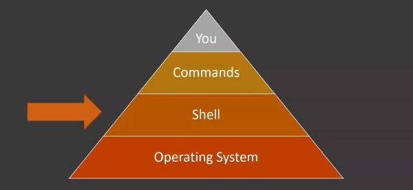
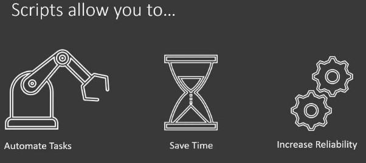

# Comment construire un script bash

Tester si bash est installé :

```bash
echo shell
```
- Si ne fonctionne pas, taper :

```bash
chsh -s /bin/bash
``` 
Et redémarrer votre ordinateur (ou Virtual machine)

## Shell vs script :

Shell : est un programme qui interprète les commandes taper sur le terminal et les passe à l’OS(linux dans notre cas) pour exécuter la commande, c’est une abstraction (simplification, communiquer directement avec l’OS serait beaucoup plus difficile)



BASH : Bourne Again Shell le plus utilisé

- beaucoup de feature
- rapide
- très utilisé
- portable

Shell script : fichier ou les commande shell son organiser, ce même fichier sera éxécuté par shell

Bash script : Même chose que le shell mais par le bash

on utilise les scripts pour plus facilement automatiser les commandes, plutôt que toujours les écrire à la main



## Composant principal d’un script bash:

### début du fichier (shebang line) :

le shebang line permet à l’interpréteur de comprendre qu’elle type de shell, nous l'utilisons pour qu’il n’en utilise pas une autre **#!/bin/bash**

```bash
mkdir ~/bash_course
cd ~/bash_course
```

à l'entête du fichier il faut mettre un shebangline pour déterminer qu'elle est sa forme il faut taper :
```bash
which bash
```

puis entrez dans le fichier : 
```bash
nano first_script.sh
```

```bash
#!/usr/bin/bash
```

- Sauver la modification : **ctrl + o**
- Quitter nano (bien vérifié d’avoir sauvegardé le fichier) : **ctrl + x**

### Fichier Bash :

Nous allons maintenant remplir le script avec des commandes.

```bash
nano first_script
```

```bash
#!/usr/bin/bash

echo "ceci est mon premier script"

exit 0
```

Sauver et quitter le fichier.

taper les commandes suivante sur le terminal : 
```bash
chmod +x first_script
./first_script
```

Normalement vous devriez avoir une sortie, maintenant essayons autre chose.

```bash
bash first_script
```

Nous avons appelé la commande bash pour exécuter le script qui permet à ce dernier d'être utilisé même si par hasard vous oubliez de définir la shebang line, Nous utiliserons cette commande pour éxécuter le script dorénavant.

qu’avons-nous fait ?

- Dans un premier temps, grâce à echo, nous avons dit à l’os d’afficher du texte
- puis grâce à la commande **chmod**, nous avons permis à l’os de rendre le script exécutable, sans quoi nous aurions eu une erreur de permission
- l’exit code à la dernière ligne sert à dire à un utilisateur ou machine que l’exécution code est fini, en plus de ça l’exit code sert à déterminer si c’est un succès, un échec ou autre (il y a 256 possibilités de 0 à 255), si l’exit code et à 0, c'est un succès tout autre exit code signifie l’échec de l’exécution du script par convention, on utilise exit code 1 pour signifier l’échec du script

plus de détail sur les différent status pour [exit](https://tldp.org/LDP/abs/html/exitcodes.html)

## Composant professionnel d’un script bash :

Ajout de commentaire :

l’ajout de commentaire permet de rendre le code plus lisible pour faciliter le travail d’une personne qui reprendrait votre code

on utilise **#** pour rendre le texte commentaire

```bash
#!/usr/bin/bash

# Author : Jonathan Ndamba
# Date created : 31/12/2022
# Last modified : 31/12/2022

# Description :
# Ce script affiche du texte

#Usage
# bash first_script ou ./first_script

echo "Ceci est mon premier script

exit 0
```

Rien de très compliqué ici, le comportement du code ne change pas étant donné que nous n’avons que modifier le comportement du code ce pendant cette étape est importante si vous travaillez en équipe sinon personne ne comprendra ce que vous chercher à faire et il pourra être abandonné.


Les permissions servent à donner des droits pour un certain type d’utilisateur à certains types d’actions
```bash
ls -l
```
```bash
chmod 744 first_script
```
```bash
ls -l
```
Explication :

**ls** : permet de voir les fichiers et dossier dans le répertoire courant

**ls -l** : permet en plus de voir les fichier et les dossier les permission l'user chmod : permet de modifier les permission du fichier

on peut aussi à la place de chmod 744 utiliser : 

```bash
chmod +x first_script
```


le nombre peut être difficile à retenir ou à interpréter, aller sur ce [lien](https://chmod-calculator.com/) pour mieux le comprendre