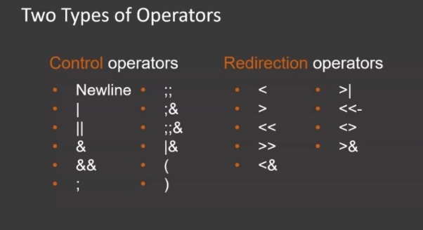

# Comment Bash gère les ligne de commande 

## Quoting

permet de supprimer les effets des caractères spéciaux et donc traité comme une chaîne de caractère

\ : supprime les effets des caractères spéciaux après le \

'' : supprime les effets des caractères spéciaux à l’intérieur des ''

"" : supprime les effets des caractères spéciaux à l’intérieur des "" à l’exception de $ et `

Exemple :
```bash
echo john & jane
```
```bash
echo john \& jane
```
```bash
filepath=C:\User\jojo\Documents
```
```bash
echo $filepath
```
```bash
filepath=C:\\User\\jojo\\Documents
```
```bash
echo $filepath
```
```bash
filepath='C:\User\jojo\Documents'
```
```bash
echo $filepath
```
```bash
filepath="C:\User\\$USER\Documents"
```
```bash
echo $filepath
```

## Tokenisation

La tokenisation en bash est le processus de séparation d'une chaîne de caractères en unités distinctes appelées "tokens". 




- Token = une chaîne de caractère qui est considéré comme une unité unique par shell Word = un token qui ne contient pas de metacharacters sans quoting
- Word = un token qui ne contient pas de metacharacters sans quoting
- Operator = un token qui contient au moins un metacharcter sans quoting


Exemple :
```bash
name=lolilol
echo $name > out.txt
```
## Expansions

Rappel :

- Brace Expansion
- parameter expansion
- command substitution
- tilde expansion
- arithmetic expansion

Nouveau :

- world splitting
- globbing

### World Splitting

La word splitting est un processus en bash qui divise une chaîne de caractères (appelée "mot" ou "word" en anglais) en plusieurs sous-chaînes (ou "mots") en utilisant un caractère spécial appelé IFS (Internal Field Separator).
En bash, lorsqu'une commande est exécutée, le shell divise les arguments de la commande en mots en utilisant l'IFS comme séparateur. 
Par défaut, l'IFS est configuré pour inclure les espaces, les tabulations et les sauts de ligne. Ainsi, si un argument contient un ou plusieurs de ces caractères, il sera divisé en plusieurs sous-arguments.

- Parameter expansions
- Command subtitutions
- Arithmetic expansions

Ce qui permet à shell de déterminer comment séparer les charecter sont les IFS (Internal Field Separator) :

- espaces
- tab
- new line

Exemple :
```bash
numbers="1 2 3 4 5"
touch $number
ls
```
ici ce sont les espaces qui permettent de déterminer comment séparer les caractères

```bash
rm {1..5}
ls
```

## Globbing

ne marche que pour les mots (pas les opérateurs) Les différents globbing patterns :

- \*
- ?
- [

example
```bash
touch file\_{0..10}.txt
touch file\_{0..10}.pdf
ls \*
ls \*.pdf
ls \*.txt
ls file\_\*.txt
ls file\_\*.pdf
ls file\_?.txt
ls file\_??.txt
ls file\_??.pdf
ls file\_[0].pdf
ls file\_[0-5].txt
rm file\_{0..10}.\*
```
## Quote Removal

Le "quote removal" (suppression des guillemets) en bash fait référence au processus par lequel les guillemets entourant une chaîne de caractères sont supprimés pour interpréter correctement les commandes et les arguments. 
Les quotes sont conservés si elles résultent d’une expansion shell

Rappel:


suppression de tous les Quote qui ne viennent pas d’une shell expansion, et qui ne sont pas “Quoted”

Exemple :

```bash
echo $HOME
echo \$HOME
echo '\$HOME'
```

## Redirection

La redirection en bash est un mécanisme qui permet de modifier les entrées et les sorties d'une commande ou d'un processus. Elle est couramment utilisée pour envoyer le résultat d'une commande vers un fichier, lire les données d'un fichier ou combiner les sorties de plusieurs commandes.


Exemple :
```bash
echo “this is some output” > output.txt
```
```bash
cat output.txt
```
```bash
cd /root
```
```bash
cd /root error.txt
```
```bash
cd /root 2> error.txt
```
```bash
cat error.txt
```
```bash
cd /root &> error.txt
```bash
cat error.txt
```
```bash
cd /root >> error.txt
cd /root >> error.txt
cd /root >> error.txt

cat error.txt
```

```bash
echo "lol" >> lol.txt
echo "lol" >> lol.txt
echo "lol" >> lol.txt

cat lol.txt
```

- \> : Redirige la sortie standard vers un fichier, en écrasant le contenu du fichier s'il existe.
- \>> : Redirige la sortie standard vers un fichier, en ajoutant le contenu à la fin du fichier s'il existe.
- < : Redirige l'entrée standard depuis un fichier.
- 2> : Redirige la sortie d'erreur standard vers un fichier, en écrasant le contenu du fichier s'il existe
- 2>> : Redirige la sortie d'erreur standard vers un fichier, en ajoutant le contenu à la fin du fichier s'il existe.
- &> ou >& : Redirige à la fois la sortie standard et la sortie d'erreur standard vers un fichier, en écrasant le contenu du fichier s'il existe.
- &>> : Redirige à la fois la sortie standard et la sortie d'erreur standard vers un fichier, en ajoutant le contenu à la fin du fichier s'il existe.
